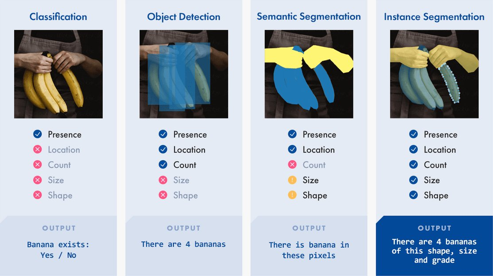
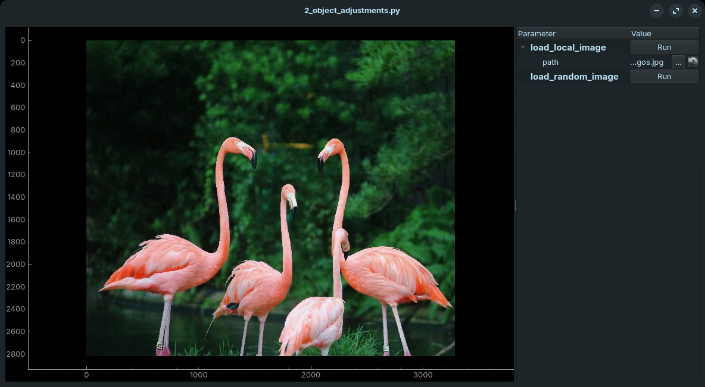
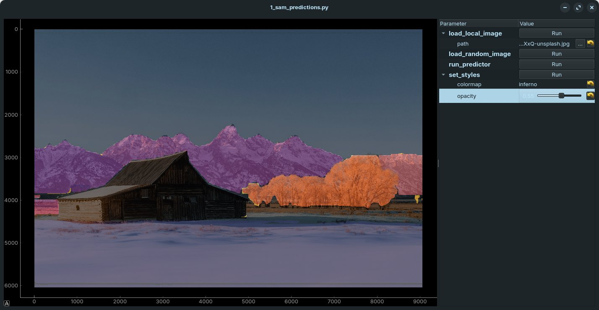
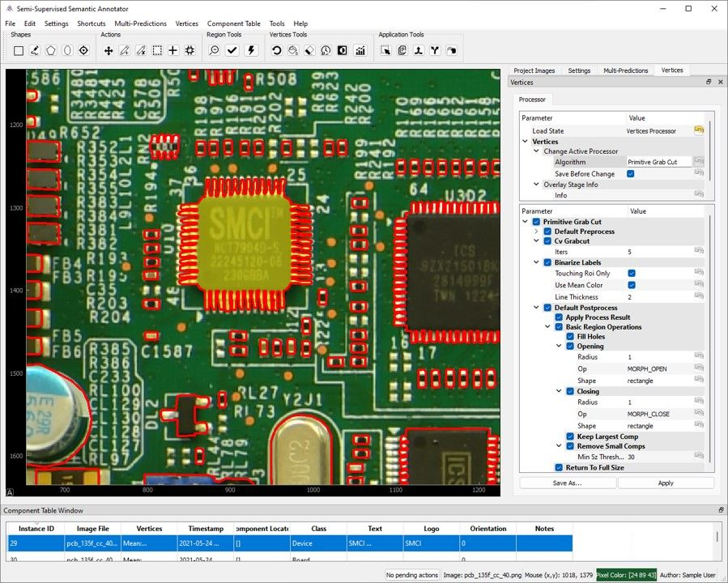

# SciPy 2024 Tutorial Submission: Annotationem ex Nihilo
**Create an Image Labeling Tool from Scratch using PyQtGraph and FastSAM**

Contributors:

- Nathan Jessurun

## Short Description

Image annotation is an essential part of computer vision and machine learning workflows,
but is an incredibly soul-sucking manual task. Several tools provide automated
assistance, but they are often complex, difficult to customize, or hidden behind a
paywall. This tutorial empowers attendees with knowledge of an annotation tool's fundamental components, using PyQtGraph for visuals and FastSAM for automated labeling. Along the way,
they will learn the basics of real-time data visualization, Qt Python GUI development, and
image annotation -- skills that broadly apply beyond the walls of this tutorial.

## Long Description

### Topic Overview

Image annotation is the bedrock of computer vision machine learning tasks. Unfortunately, it is also time-consuming and soul-sucking. However, a small amount of automation can go a long way in reducing the time and effort required to label images. This tutorial "teaches a man to fish" with groundwork in each major area of the image labeling process: displaying data, handling user input, adding automation, and saving the results. Toward this end, the following objectives are covered
- **Computer Vision**: Basic image handling (loading, resizing, pytorch/numpy manipulation), morphological operations (erosion/dilation, contour detection), CV models (Ultraltyics FastSAM usage)
- **Interactive plotting**: Basic PyQtGraph window setup, forms of data representation (image, scatterplot, axis scaling), hooking into user input
- **Qt for Python**: Qt events, signals and slots
- **General data science practices**: Data visualization, python ecosystem integration, and general programming practices

### Who Should Attend?
Minimal prerequisite experience is required to attend this tutorial, as it is geared primarily toward novice-to-intermediate Python data scientists. That said, it assumes attendees have strong familiarity with the Python language itself, specifically around:
- Object-oriented programming
- Decorators
- Documentation browsing

The table below provides a rough outline of the material and skill level which will be taught in each given topic:

<table>
<thead>
  <tr>
    <th></th>
    <th></th>
    <th style="text-align: center" colspan="3"><b>Topics Covered</b></th>
  </tr>
</thead>
<tbody>
  <tr>
    <td></td>
    <td></td>
    <td>Computer vision</td>
    <td>Interactive plotting</td>
    <td>Qt for Python</td>
  </tr>
  <tr>
    <td rowspan="3" style="writing-mode:vertical-rl; transform: rotate(180deg)"><b>Tutorial Depth</b></td>
    <td>Novice</td>
    <td>✅</td>
    <td>✅</td>
    <td>✅</td>
  </tr>
  <tr>
    <td>Intermediate</td>
    <td>✅</td>
    <td>✅</td>
    <td>-</td>
  </tr>
  <tr>
    <td>Expert</td>
    <td>-</td>
    <td>-</td>
    <td>-</td>
  </tr>
</tbody>
</table>


### Outline

- Overview [10 minutes]
    - Give a brief overview of annotation as a concept and its usefulness
    - Get everyone setup with tutorial materials
<div style="text-align:center">

</div>

- Creating a basic image viewer [40 minutes]
    - Introduction to PyQtGraph, Qt, and GUI anatomy
    - Gathering independent examples of `ImageItem`, `PlotWidget`, and `ParameterTree` into a coherent application

<div style="text-align:center">

</div>

- [10 minute break]

- Segment the current image using `FastSAM` & add configurations [50 minutes]
    - Understand the basics of `FastSAM`, how to use it, and how to massage its outputs
    - Hook up model inputs and outputs to the GUI, along with a few customizations such as a colormap LUT and random image selection
<div style="text-align:center">

</div>

- [10 minute break]

- Enable user-selectable region building [50 minutes]
  - Configure relevant signals, slots, and event hooks to enable user interaction
  - Create a graphics item which conglomerates user inputs
  - Ensure updates are high-performance enough not to lag the GUI

<div style="text-align:center">
<video controls src="./slides/media/region-builder.mp4" width="50%"/>
</div>

- [20 minute break -- I anticipate this is where inexperienced users will need to catch up, so a larger pause is provisioned]

- Persist user edits [50 minutes]
  - Undo / redo region edits
  - Save prediction mask and edits to disk
  - Load prediction mask and edits from disk

- Enable manual edits using a brush [20 minutes]
  - Unobtrusive switching between add/remove
  - Brush size and shape configuration

- Future work: incorporate image processing algorithms, metadata, QA, etc. [10 minutes]

<div style="text-align:center">

</div>


- Conclusion [10 minutes]
  - Summary of topics: Graphics, user interaction, automation
  - When the right move is to use commercial tools

### Comments

The author has multiple publications and oral presentations discussing how annotation quality impacts machine learning models used for printed circuit board analysis. This tutorial is a condensed version of the concepts used to build [S3A](https://gitlab.com/TerraVerum/s3a), an open source labeling tool which the author created and maintains.

While it would be ideal to provide the tutorial in the form of Jupyter notebooks, they don't lend themselves well to Qt and real-time interactivity. So, several separately numbered python scripts are provided instead. The code will be available on GitHub beforehand, but the goal is for participants to follow along live and start from scratch.

Additional progress on the tutorial material will be uploaded to https://github.com/ntjess/2024-pyqtgraph-sam

## Setup Instructions
1. Install python dependencies
```bash
pip install      \
    numpy        \
    pyqtgraph    \
    PySide6      \
    qtpy         \
    scikit-image \
    torch        \
    ultralytics
```

2. Download FastSAM model weights
```bash
wget https://github.com/ultralytics/assets/releases/download/v8.1.0/FastSAM-x.pth
```
